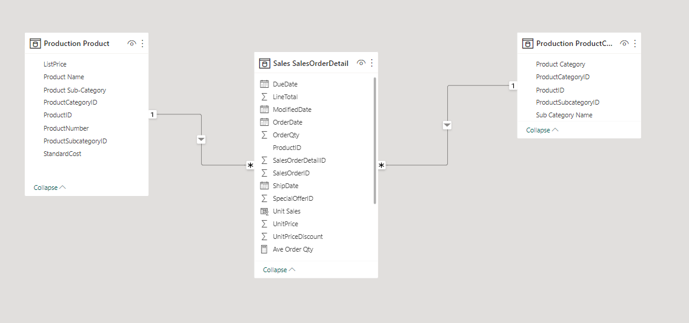
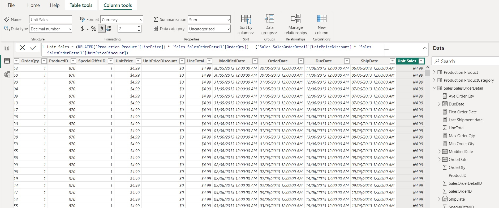
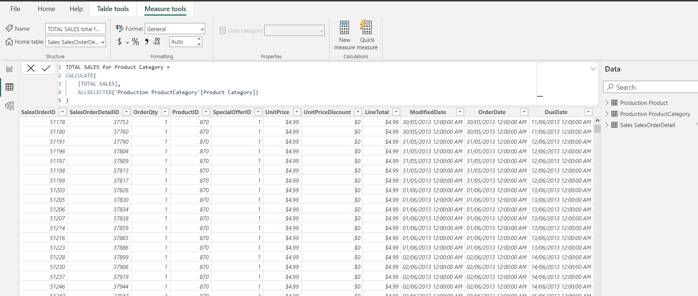
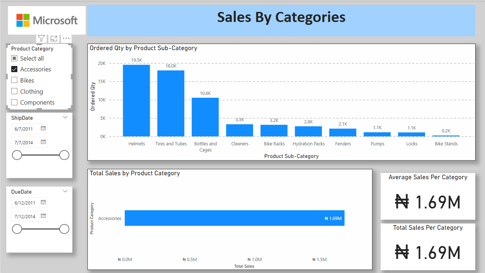
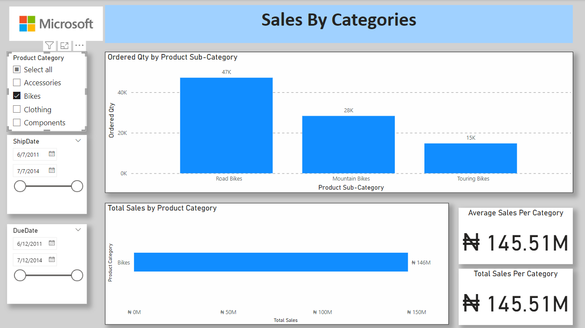
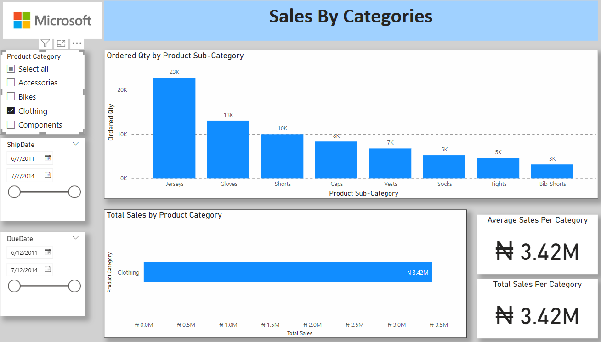
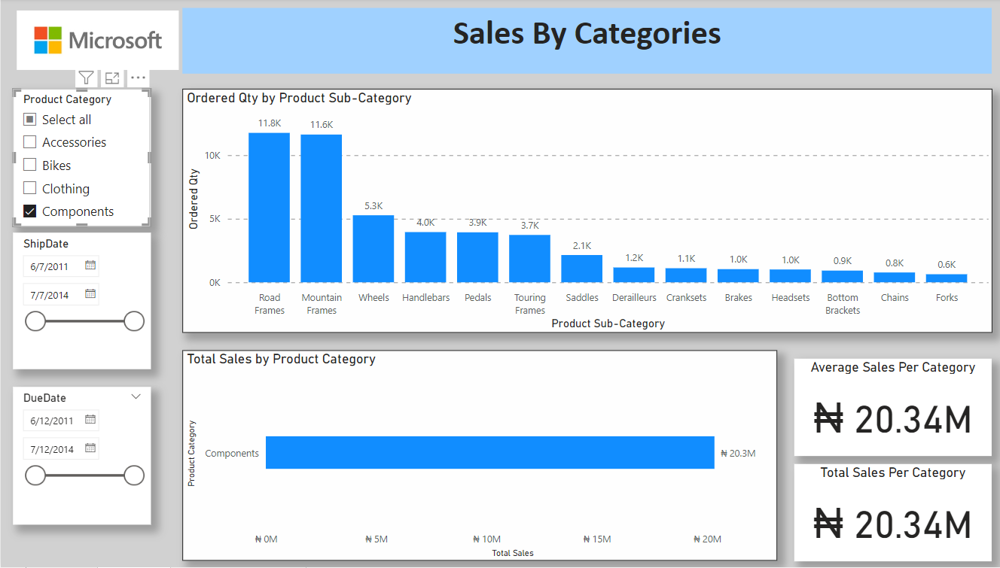

# Project-2
## Analyze Sales Data to identify which products have the highest turnover rate

Average Qty of items ordered is 2.27
---
## Introduction
This is a Power Bi Project of the Sales & Inventory Analysis of a fiticious Company **Fitcapacity Company**
The Project is to analyze and derive insights to answer crucial questions and make 
the company make data driven decision

_Disclaimer_ : _Datasets from the Microsoft Adevtureworks database. Used to demomstrate my learnings and capabilities
with Proving Data Driven Decisions woth power BI_

# Objecive:
## To provide insights into products with highest or lowest turnover sales

# Problem Statement
1. What Product categories had the highest turnover?
2. What Product categories had the lowest turnover?

# Skills and Concepts demonstrated:
## The following Power BI features were incorporated
## Getting data from the server (Microsoft based via local host computer)
- 
## Modelling relationships with tables where relationships of one to many was created between 2 dimension tables and 1 fact table after proper exploratory data analysis
- 
## DAX and Calculated Measure
- 
## Quick Measure
- 

## Visualization
The report comprises 5 pages:
1. Category Sales By Quantity
2. Sales By Categories

# Detailed Analysis of each Category Sales

## Accessories Category Sales
- 
- Total Sales = NGN 1.69m

## Bikes Category Sales
- 
- Total Sales = NGN 145.51m

## Clothing Category Sales
- 
- Total Sales = NGN 3.42m

## Components Category Sales
- 
- Total Sales = NGN 20.34m
You can interact with the report [here](https://app.powerbi.com/groups/me/reports/9692cb45-0a24-4a77-be8d-00437d3d399a/ReportSection82f013fd748601c36982?experience=power-bi)

# Summary:
## Bikes has the Highest Sales Turover while Accessories has the Lowest Sales Turnover
