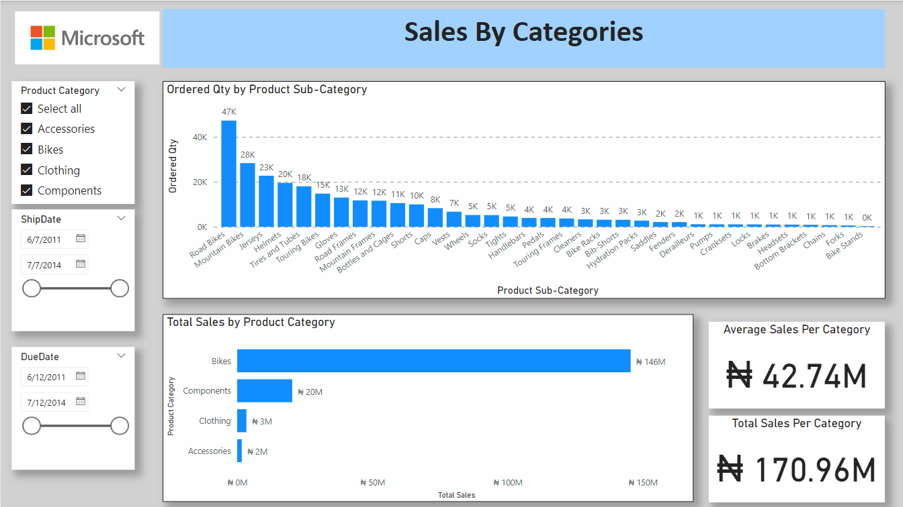
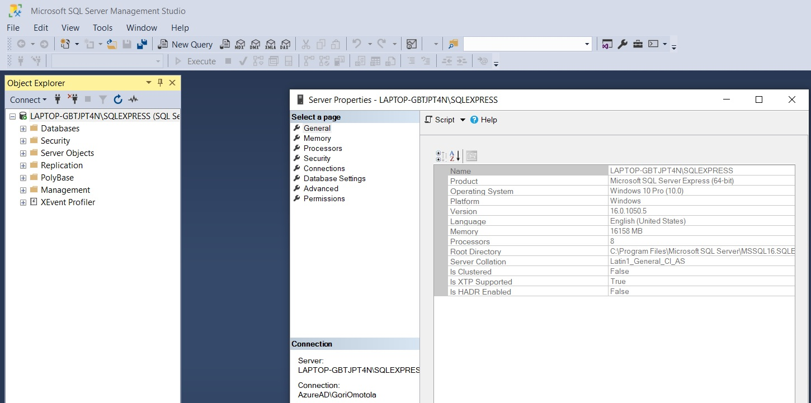

# Project-2
## Analyze Sales Data to identify which products have the highest turnover rate

Average Qty of items ordered is 2.27
---
## Introduction
This is a Power Bi Project of the Sales & Inventory Analysis of a fiticious Company **Fitcapacity Company**
The Project is to analyze and derive insights to answer crucial questions and make 
the company make data driven decision

_Disclaimer_ : _Datasets from the Mircosoft Adevtureworks database. Used to demomstrate my learnings and capabilities
with Proving Data Driven Decisions woth power BI_

# Objecive:
To provide insights into products with highest or lowest turnover rates

# Problem Statement
1. What Product categories had the highest turnover?
2. What Product categories had the lowest turnover?

# Skills and Concepts demonstrated:
The following Power BI features were incorporated
- Getting data from the server (Microsoft based via local host computer)
- 
- Modelling relationships with tables
- 
- DAX and Calculated Measure
- Page Navigation and Button
